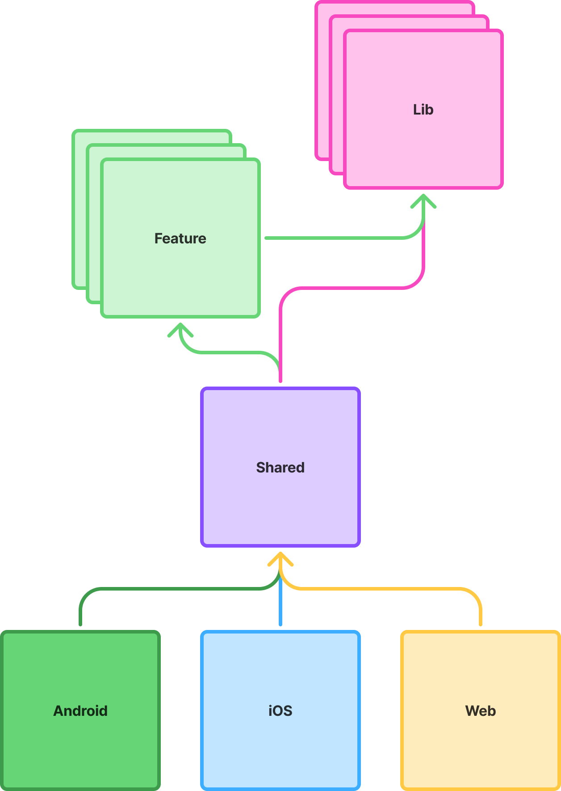

# JetKollage

JetKollage is a Jetpack Compose Multiplatform application that allows users to create collages from their images. 
This project uses Kotlin Multiplatform and targets Android, iOS and Web.

## ✨ Features

*   **Cross-Platform:** Runs on Android and iOS using a single Kotlin codebase.
*   **Image Selection:** Pick images from the device gallery.
*   **Collage Creation:** Arrange selected images into a collage layout.

## 🛠️ Setup

### Prerequisites

(You can use KDoctor help you set up the environment)[https://www.jetbrains.com/help/kotlin-multiplatform-dev/multiplatform-setup.html#check-your-environment]

NOTE: coca-pods aren't used in this project

*   Android Studio (latest stable version recommended)
*   Xcode (for iOS development)
*   (Kotlin Multiplatform plugin for Android Studio)[https://plugins.jetbrains.com/plugin/14936-kotlin-multiplatform]

### Building and Running

1.  **Clone the repository:**
    ```bash
    git clone https://github.com/your-username/JetKollage.git
    cd JetKollage
    ```
2.  **Open in Android Studio:**
    Open the project in Android Studio. It should automatically sync and download necessary dependencies.
3.  **Android:**
    Select the `androidApp` run configuration and choose an emulator or connected device. Click the "Run" button.
4.  **iOS:**
    *   Open the `iosApp/iosApp.xcworkspace` in Xcode.
    *   **Important:** To run on physical device you will need to set your development team in Xcode for the `iosApp` target under "Signing & Capabilities" for running on device.
        *   In `project.pbxproj`, the `DEVELOPMENT_TEAM` ID needs to be set for both `Debug` and `Release` configurations. If you are working on a team, ensure this is configured appropriately.
    *   Select an iOS simulator or a connected device.
    *   Click the "Run" button in Xcode.

#### Running web

To run the web application, execute the Gradle task `app:web:wasmJsBrowserDevelopmentRun` from Android Studio. Here are common ways to do this:

1.  **Using the Gradle Tool Window:**
    *   Open the **Gradle** tool window (usually on the right-hand side of Android Studio, or select `View > Tool Windows > Gradle`).
    *   You can then either:
        *   Navigate to the task. The path might be something like: `YourProjectName` -> `app` (or your KMP module) -> `web` (if structured as a sub-project) -> `Tasks` -> `kotlin browser` -> `wasmJsBrowserDevelopmentRun`. The exact path can vary. Double-click the task to run it.
        *   Or, click the "Execute Gradle Task" icon (looks like an elephant with a play button) at the top of the Gradle tool window. In the dialog that appears, type `app:web:wasmJsBrowserDevelopmentRun` and press Enter.

2.  **Using the Terminal within Android Studio:**
    *   Open the **Terminal** tool window (`View > Tool Windows > Terminal`).
    *   Run the following command:
        ```bash
        ./gradlew app:web:wasmJsBrowserDevelopmentRun
        ```
        (On Windows, you would use `gradlew.bat app:web:wasmJsBrowserDevelopmentRun`)

After the task successfully starts the development server, look for a URL in the console output (typically `http://localhost:8080`). Open this URL in your web browser to view the application.

## 📱 Architecture



## 📄 License

This project is licensed under the Apache License 2.0 - see the [LICENSE](LICENSE) file for details (if applicable, or choose another license).

---

*This README is a work in progress and will be updated as the project evolves.*